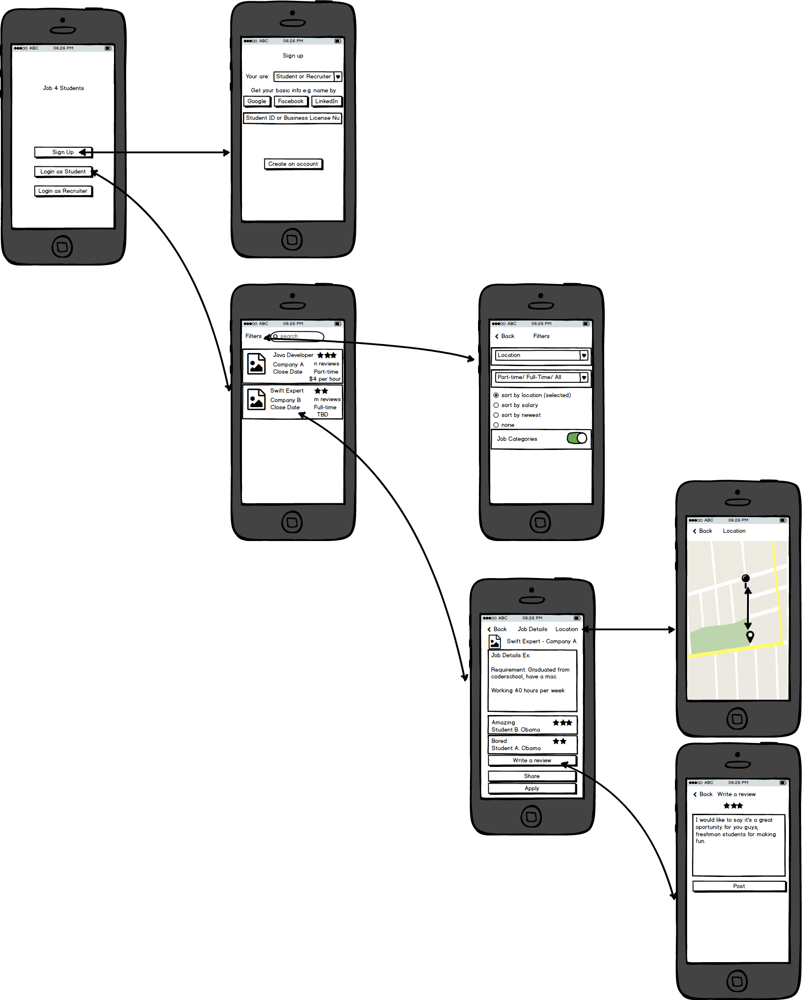
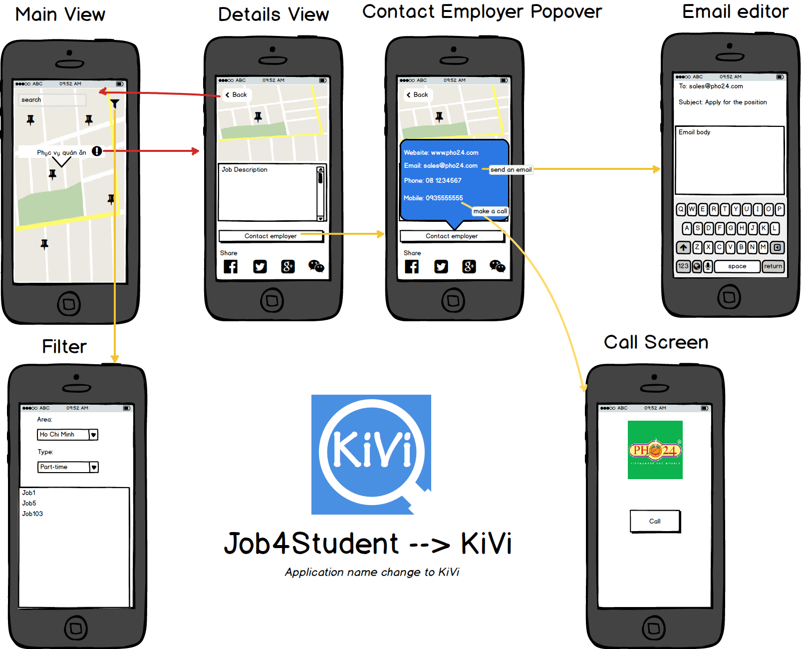

# Job4Students
Jobs Network for Students, Companies and Universities, Colleges, Schools,...

# Descriptions:
Job4Students is an application for iOS. 
Users for the app includes: Students in Schools, Colleges, Universities.
Companies will post job advertisements on this network, students can check and apply for full time or part time jobs.
This app will connect Students, Universities and Companies so they can meet what they need and what they want.
Through this network, peole can save money and time for job hunting, head hunting.
The differences from current Job Search is that this one only use for students. So companies need fresh engineers, BA can focus on this network and search for them. PhD or Doctors also can join the networks.

## REQUIRED:
- User can sign up/sign in using email or OAuth loging flow with Google, Facebook or Twitter.
- The current signed in user will be persisted across restarts

### For Students:
- Must have student ID to be qualified as a student, universities will help to verify this ID.
- Can set interested job fields, e.g: engineering, marketing, ... and set notifications.
- Application must have push notification when new jobs are posted by companies.
- Can share jobs info to their friends through Social: Facebook, Twitter, Google+

## OPTIONALS:
### For Students: 
- Can share jobs info to their friends through Email, SMS.
- Also can set job expectations on their profiles.
- Can set profiles for private or public.

### For Companies:
- Payment method for companies: bank card, bank account or cash
- Currency for payments.

### For Companies:
- Must input Business License number to be qualified.
- Can post jobs.
- Can post expectations, requirements for students.
- Can search database to select students.
- Will pay for application and services to get premium access into database.

### For Schools, Colleges, Universities:
- Review expectations from Student.
- Review companies' expectations and requirements to update their program to fit them.

## App Wireframe: 

## Notes:
- Project is developed based on XCode 7

